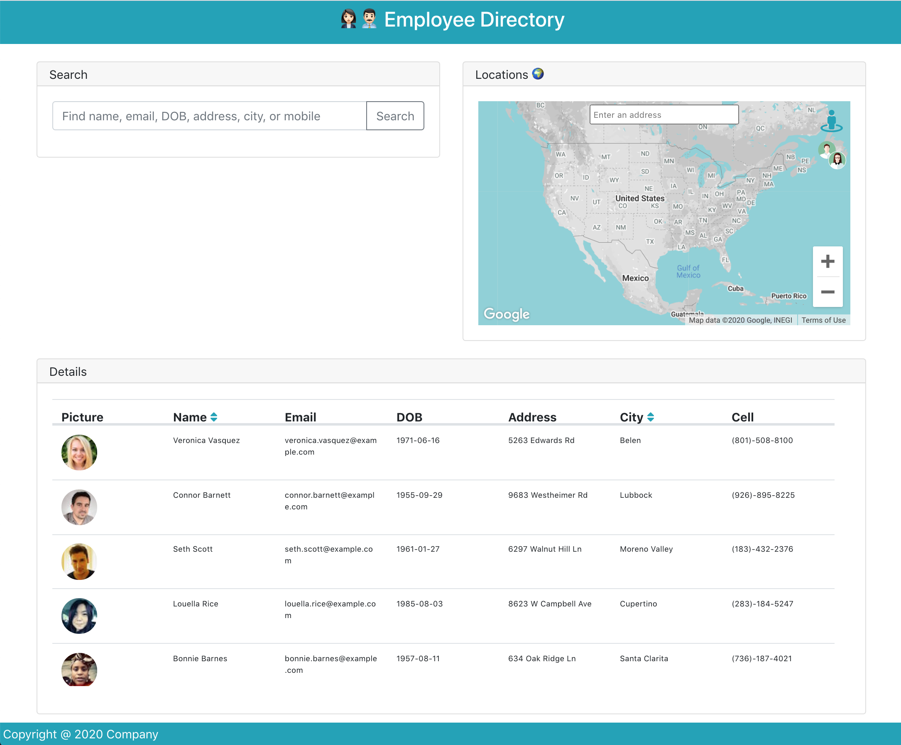
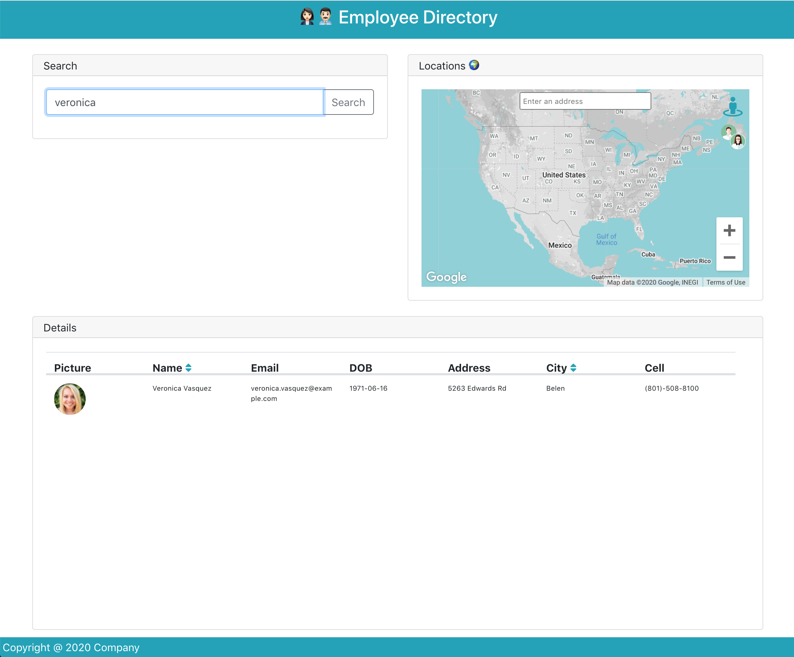
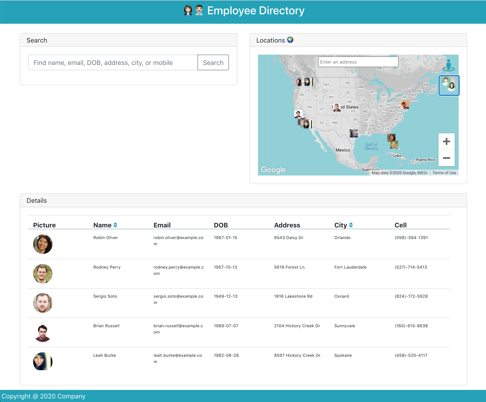
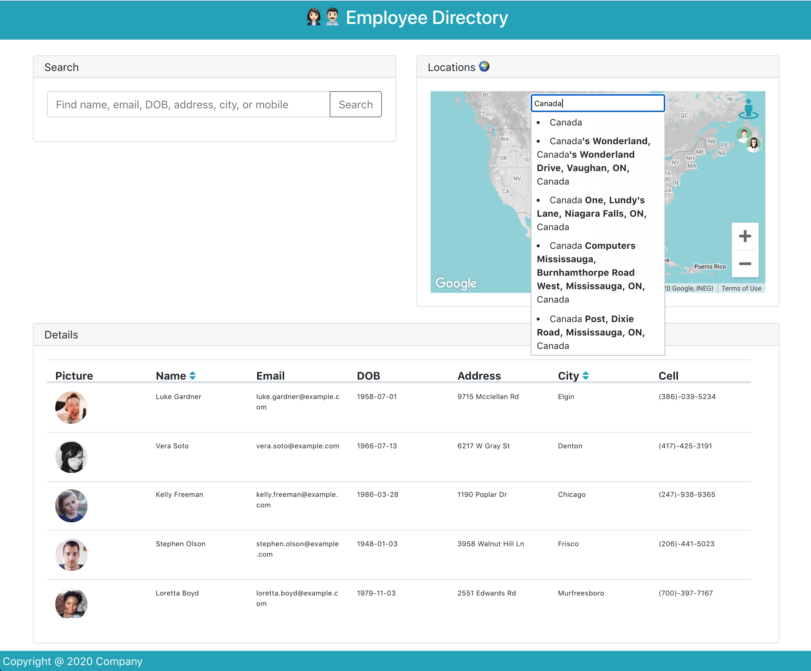

# Employee Directory

The Employee Directory is a React application that loads a dataset of employees, allowing the user to make searches, sort, and view employees' address displayed in a Google Map.

## Badges

Code quality and validation

Repository Status

License

## Table of contents

- [Employee Directory](#employee-directory)
  - [Badges](#badges)
  - [Table of contents](#table-of-contents)
  - [The challenge](#the-challenge)
  - [The development process](#the-development-process)
  - [The Output](#the-output)
  - [Installation and Usage](#installation-and-usage)
  - [Credits, tools and other references](#credits-tools-and-other-references)
  - [Contributing](#contributing)
  - [Questions](#questions)

## The challenge

To create a employee directory with React, break up the application's UI into components, manage component state, and respond to user events.

Main elements:

- [x] React components
- [x] Google Maps
- [x] Props ans State management
- [x] Use of an external source for loading employees' data

## The development process

In order to accomplish the challenge, the following steps were done:

1. Define the purpose, and concept of the application.
2. Define the UI's main components
3. Research Google Maps for React.
4. Research other assets.
5. Create the components and the functionality.
6. Final review and proper documentation.

## The Output

With the described process we were able to create a useful and efficient single page React application.

**User stories**

1. As an user, I want to be able to view my entire employee directory at once so that I have quick access to their information.
2. As an user, I want to sort the table by name or city.
3. As and user, I want to filter the employees by name, email, date of birth, adress, city or mobile.
4. As a user, I want to click on the Map employees icon to display markers of the employees addresses of the table.
5. As a user, I want to click the Geo-location icon so the map will take me to my current location.
6. As a user, I want to find any address in the map.

**The application**

## Installation and Usage

The project was uploaded to [GitHub](https://github.com/) at the following repository:
[https://github.com/jorguzman100/19_employee_directory](https://github.com/jorguzman100/19_employee_directory)

You can access the deployed application with the Heroku link:
[https://jorguzman100.github.io/19_employee_directory/](https://jorguzman100.github.io/19_employee_directory/)

To install the project follow these steps:

1. Clone the application from GitHub with:
   - git clone [clone link from GitHub]
2. From the root folder, install the dependencies with:
   - npm install
3. Run the app with:
   - npm start

## Credits, tools and other references

**Third Party Assets**

[RandomUser.me API](https://randomuser.me/)

[Google Maps API](https://developers.google.com/maps/documentation)

[Google Maps React API](https://www.npmjs.com/package/@react-google-maps/api)

[Google Places React](https://www.npmjs.com/package/use-places-autocomplete)

[Reach Combobox](https://reach.tech/combobox/)

[Snazzy Maps Style](https://snazzymaps.com/style/8097/wy)

[Browser Geolocation](https://developer.mozilla.org/en-US/docs/Web/API/Geolocation/getCurrentPosition)

[Bootstrap](https://getbootstrap.com/)

[Font Awesome](https://fontawesome.com/)

[Shields.io](https://shields.io/)

[LGTM](https://lgtm.com/)

[Markup Validation Service](https://validator.w3.org/)

**Tutorials**

[How to Set Dynamic Property Keys with ES6](https://www.samanthaming.com/tidbits/37-dynamic-property-name-with-es6/)

[Table fixed header and scrollable body](https://stackoverflow.com/questions/21168521/table-fixed-header-and-scrollable-body)

[How TO - Sort a Table](https://www.w3schools.com/howto/howto_js_sort_table.asp)

[JavaScript Problem: Sorting an Array of Objects](https://www.youtube.com/watch?v=0d76_2sksWY)

## Contributing

- Pull requests are welcome.
- For major changes, please open an issue first to discuss what you would like to change.
- Please make sure to update tests as appropriate.

## Questions

If you have questions or you want to share comments, we will be glad to hear from you. Please contact us at jorguzman100@gmail.com.
