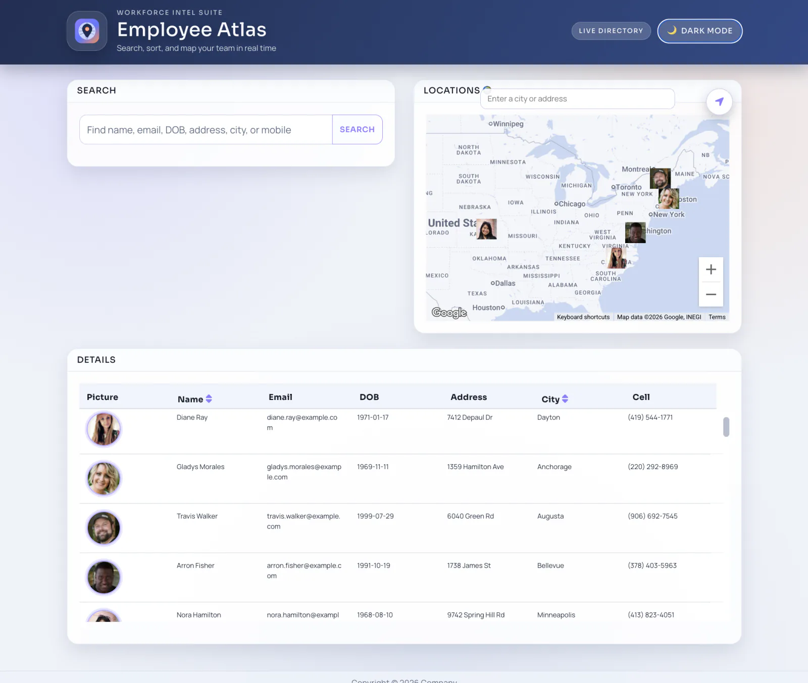

# 🗺️ Employee Atlas

### A visual employee directory that makes searching your team a bit more interesting 😉.

Employee Atlas is a React app that pulls employee data from Random User and turns it into a searchable, sortable directory with a live Google Map view. It is built for quick lookup workflows: scan the table, filter results, click a row, and instantly see where that person is located.

---

## ✨ Features

| | Feature | What It Does |
|---|---|---|
| 🔎 | Smart search | Filters employees by name, email, DOB, address, city, and phone in real time. |
| ↕️ | Sort controls | Sorts the directory by employee name or city with one click. |
| 🗺️ | Live map sync | Keeps the map focused on the employees currently visible in the table. |
| 📍 | Location tools | Includes geolocation and Places autocomplete to jump around the map quickly. |
| 🎯 | Row selection focus | Clicking a table row highlights it and centers the map on that employee. |
| 🌗 | Theme toggle | Light/dark theme switch with localStorage persistence. |

---

<p align="center">
  
</p>

---

## 🛠️ Tech Stack


---

## 🧩 Project Snapshot

- Modern React + Vite frontend with component-based UI for header, search, map, table, and footer.
- Node/Express server proxies employee requests through `/api/employees` to avoid production CORS issues.
- Data source order is `randomuser.me` first, then local mock fallback when Random User is unavailable.
- Google Maps JavaScript API (weekly channel) powers geocoding, markers, and autocomplete suggestions.
- Table visibility tracking syncs the map with the rows currently in view (after search/sort/scroll).
- Render deployment is configured as a Node web service (`render.yaml`) serving API + frontend build.

Project layout:
- `client/`: React + Vite app (`src`, `public`, `index.html`, Vite config).
- `server/`: Express API and production static serving.

---

## 🚀 Live Demo

<p align="center">
  <a href="https://employee-directory-7hk1.onrender.com/" target="_blank" rel="noopener noreferrer">
    
  </a>
</p>

<p align="center">
  <a href="https://employee-directory-7hk1.onrender.com/"><strong>https://employee-directory-7hk1.onrender.com/</strong></a>
</p>

---

## 💻 Run it locally

```bash
git clone https://github.com/jorguzman100/employee-directory.git
cd employee-directory
npm install
cp .env_example .env
npm run dev
```

Optional production build check:

```bash
npm run build
```

Local URL:

- Frontend (Vite): `http://localhost:5173`
- Backend (Express): `http://localhost:4000`

<details>
<summary>🔑 Required environment variables</summary>

```env
# .env
VITE_GOOGLE_MAPS_API_KEY=your_google_maps_api_key_here
```

Google Maps note: enable both the **Maps JavaScript API** and **Places API** for the key.
</details>

---

## 🤝 Contributors

- **Jorge Guzman**  ·  [@jorguzman100](https://github.com/jorguzman100)
